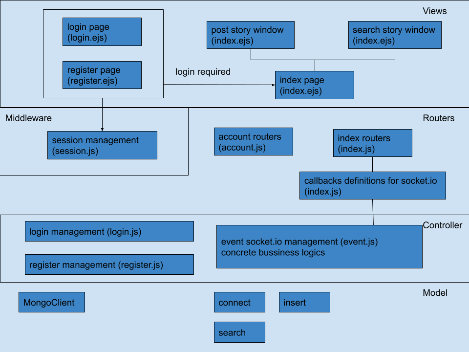

# Introduction
The name of our project is “showoff” which is a web application for sharing texts and pictures online. The whole app is divided into 3 parts: database, back-end logic and front-end logic. Front-end code is made up by a combination of javascript, html and css codes. A local indexed database is used to cache data returned from the server, PWA techniques such as service worker are used to make sure that the app is more reliable. Back-end logic is built up by Node.js, and Mongodb is used as permanent data storage (not implemented yet). Data transferred between client and server is in Json form, client uses Ajax to implement login/register logic, and socket.io for other functions.

# Diagram

# Tasks
## Interface to insert and search data via forms
### Challenges
Users use forms and buttons on a web page to post data to the server, which involves front-end code to set up these widgets on the page and call Ajax/socket.io to send data asynchronously. Back-end codes are also needed to cooperate with data uploaded by clients. Therefore a data form needs to be defined so that it can apply to both side. As Json is used to serialize and deserialize data, some errors must be handled if a Json string is not legal.
### Solution
We use simple forms and buttons on html to create home page for our app, which makes the page simple and easy to use, and also simplifies the development. Only login and register logic require Ajax requests to post data to the server while all the other operations (such as post new story to server) are done by socket.io. This is because socket.io is much more flexible to transfer data, and more friendly for developers since it takes less time to learn how to use it. JSON built in javascript is used to manipulate Json strings. all the data is in JSON form.
### Requirements
Both Ajax and socket.io techniques are used to transfer data, and all the data transferred is in Json form.
### Limitations
The design might not be suitable for large scale websites, as its performance is not so good. One single Json string is returned when client asks for stories posted by a given user id. If there are a lot of stories of this user, the returned Json string would be very large that it may take long time for browser to download, during which the browser may be irresponsible.

## Interface to search data via map
### Challenges
The biggest challenge is how to use Google map’s API. There should be a map on the web page for user to select a position, and the coordinate of the location should be uploaded to the server.
### Solution
We have applied for an api key of Google map api so that we can use google map on our website. With this key, we embedded a google map into the search window of our website. 
### Requirements
With the support of google map, when users post their stories, this function is able to record the locations of users' stories. Besides, it allows the website to record the coordinates when users select a location on the map. With this solution, we can compute the distance between the user and the selected location , so we can provide the relevant events when a user search events near some certain locations.
### Limitations
So far, this function must run online. Therefore, only those users who connect into internet can use the google map on our website. Besides, due to the unimplemented database, we can not show any events or stories on the map, which is not user friendly enough.  

## PWA - web worker
### Challenges
It is important to decide which caching strategy should be used in the project according to different requirements of the site. For example, a static page is more suitable to use cache-only which only get data from cache. For a dynamic page, it will not update the page after caching the data. However, if a website is complicated, one certain strategy may not be the best solution of it. Also, with its features of asynchronous installation and continuous operation, deciding the update operation for it must be very careful. Since it has the ability to intercept and process network requests, the web page must be consistent with the version of the Service Work. Otherwise, the new one will process the old one of the web page or it will be controlled two versions, which may cause various problems.
### Solution
Use cache falling back to network strategy which can handle the majority of requests.
### Requirements
It enables Web App to work offline through Service Worker and provides website security through https to some extent.
### Limitations
It relys on Promise to realize. Not all browsers support it. Besides, those cache will always exist in the browser.
## PWA - indexed DB
### Challenges
It is difficult to define the order of operations, such as open the database and insert data into the table, when these functions are put in page loading function. That means the error will occur because it operates insert data function before opening the database. Meanwhile, key generator is not suitable for the whole website. Though it would be fine if it only stores the data from browser, when the data is from the server, it may store several repeated data with different keys.  
### Solution
For the first problem, a proper place need to be find to put the insert function so that it can ensure that inserting operation always happens after opening database operation. For the second problem, key path is used instead of key generator, which means the key value is the existed value in the table instead of being generated by the local browser. In this case, the server need to generate the key of each data string which it receives and send them back to the client. Then the local database stores the data which it receives directly. 
### Requirements
Local database is needed to store local data so that searching information offline can be realized.
### Limitations
The data probably could not be stored immediately in the local database when it loads on the screen. 
## Nodejs - server
### Challenges
Node.js is designed to be non-blocking, so every callback function which developer writes to run on it should be non-blocking as well. This means there should be no blocking operations such as synchronously reading disk files. Since for now there is no database deployed, data is stored in memory, and asynchronous database operation will be used instead later.
### Solution
A MVC model is used to implement the server. Models are used to represent data, deals with database operation, Views are used to represent different web pages and Controllers are back-end logic codes to do different functions (such as receiving a story from client). Two different kind of routers are provided for front-end code to call, one is for account management (such as login and register), the other is  for socket.io event operation (such as posting stories). Some middleware codes are used to implement authorisation mechanisms (such as maintaining sessions).
### Requirements
The server receives and returns data to clients, it also operates with database.
### Limitations
The server is a little bit simple for implementing a product-level website. It lacks some functions that might be useful in a real product environment, such as verifying a user’s email and helping a user to find password. The server is also insufficient in performance, there should be some cache layers between back-end logic code and database, such as redis, to increase the response speed of requests.

## MongoDB
not implemented yet.

## Quality of Web solution
### Challenges
As mentioned above, the project is divided into 2 main parts: server side and client side. The biggest challenge of server side is the scalability and performance, which influence the quality of the whole website. The server should be able to handle thousands of concurrent requests, each upload of stories and events must be valid. On the other hand, the biggest challenge of client side is to combine multiple front-end techniques to build a user-friendly interface. It is not easy to organise the layout of each page and use suitable (Ajax, socket.io, etc) technique to transfer data inside it.
### Solution
As mentioned above, there are different solutions for different scenarios:
	* Data (messages) transferred inside the system is divided into 2 main kinds: account management messages (login/register logics) and application messages (stories and events data). Ajax is used to transfer account data, and socket.io for other application data. Ajax requires developers to write redundant codes, and lacks flexibility. On the other hand, socket.io is much easier to use and it needs less code. So it is more suitable to deal with large amount of data.
	* Due to event based model of Nodejs, all the callback functions are written in event based model. That means each asynchronous operation which is called uses events as notifications.
	* we only put data that is received from server into local IndexedDB, that guarantees local database is consistent with server’s, so data shown on the page is always the correct one
### Requirements
Basic requirement is to achieve a high-performance and user-friendly website.
### Limitations
Mentioned above 

# Conclusion 
Progressive website techniques are useful, with the power to continue working when offline, it will provide a more user-friendly web services for users. It’s also a trend that more and more people like using light-weighted programming language as Nodejs to develop web service, which consumes less time and provide hight performance.
# Division of work
All the members of the group contributed equally to the assignment solution. The solution was designed jointly and then each member lead the implementation of one specific part of the code, its associated documentation and contributed to the writing of the final report. In particular:
	* Yicheng Liu is in charge of the development of Nodejs server and back-end logic
	* Mali Jin is responsible for apply PWA and IndexedDB in to front-end logic
	* Hao Qian is responsible for design and implement web pages and front-end logic
/The final document was jointly edited./

# Extra Information
	* A  package.json file is provided in the project, all the dependencies are listed there. ‘npm install’ should be run before starting the website. Some main frame/library used in the project are: Bootstrap, socket.io, express, jquery, etc.
	* Because Mongodb has not been implemented and deployed yet, so for now (temporally) data uploaded will be stored in server’s memory. Codes are well structured to leave some interfaces for later modification of database. 
	* Locations will be required when users use the map to find an event, there will be a notification from the browser to ask users’ permission.

# Bibliography

